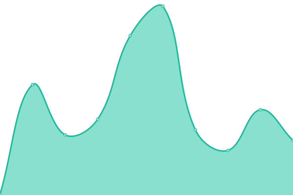
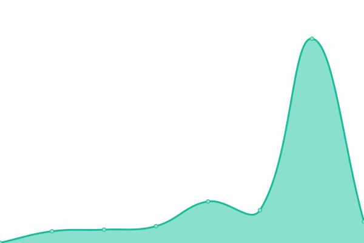

# [📈 Live Status](https://ToasterPanic.github.io/cave-of-dreams-uptime): <!--live status--> **🟧 Partial outage**

This repository contains the open-source uptime monitor and status page for [ToasterPanic](https://owouw.us/), powered by [Upptime](https://github.com/upptime/upptime).

With [Upptime](https://upptime.js.org), you can get your own unlimited and free uptime monitor and status page, powered entirely by a GitHub repository. We use [Issues](https://github.com/ToasterPanic/cave-of-dreams-uptime/issues) as incident reports, [Actions](https://github.com/ToasterPanic/cave-of-dreams-uptime/actions) as uptime monitors, and [Pages](https://ToasterPanic.github.io/cave-of-dreams-uptime) for the status page.

<!--start: status pages-->
<!-- This summary is generated by Upptime (https://github.com/upptime/upptime) -->
<!-- Do not edit this manually, your changes will be overwritten -->
<!-- prettier-ignore -->
| URL | Status | History | Response Time | Uptime |
| --- | ------ | ------- | ------------- | ------ |
|  [Client](https://dreams.owouw.us) | 🟩 Up | [client.yml](https://github.com/ToasterPanic/cave-of-dreams-uptime/commits/HEAD/history/client.yml) | 

 194ms
     
 | 

<a href="https://status.dreams.owouw.us/history/client">100.00%</a>
    

|  [Server](https://dreamserver.owouw.us) | 🟥 Down | [server.yml](https://github.com/ToasterPanic/cave-of-dreams-uptime/commits/HEAD/history/server.yml) | 

 127ms
     
 | 

<a href="https://status.dreams.owouw.us/history/server">0.00%</a>
    

<!--end: status pages-->

[**Visit our status website →**](https://ToasterPanic.github.io/cave-of-dreams-uptime)

## 📄 License

- Powered by: [Upptime](https://github.com/upptime/upptime)
- Code: [MIT](./LICENSE) © [Anand Chowdhary](https://anandchowdhary.com), supported by [Pabio](https://pabio.com)
- Data in the `./history` directory: [Open Database License](https://opendatacommons.org/licenses/odbl/1-0/)
